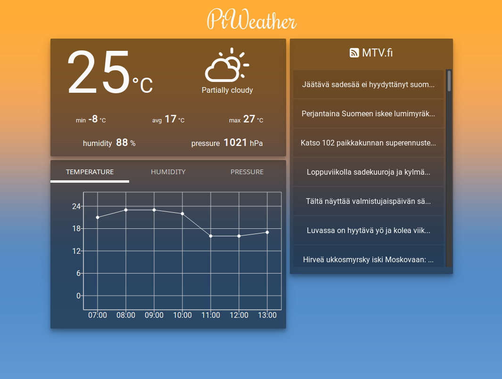

# PiWeather - a Raspberry Pi Weather Station
## "A perfect way to log and monitor local weather using a Raspberry Pi."

## Introduction ##

PiWeather is a Weather Station Application built with modern web technologies. It enables you to log and monitor weather data. 

You can use online data sources for weather data, or plug in some sensors to your Pi and log it your self - in real time.

The application polls sensors plugged into the Pi in 5 minute intervals and saves the data for later use. Currently we only log temperature and humidity.
At the end of each day the Pi analyzes the captured data and sends emails to predefined e-mail addresses.
The email message will include day's minimum, maximum and average temperatures and humidity.

A dashboard has been implemented so you can check your weather any time and anywhere. 

A RESTful API is also (almost) there - why not use it in the future?

## Technical stuff ##

* Data is stored on an SQLite database (you may use any database you like) and Redis is used to cache it to improve performance. *In the near future the app will switch using Sequelize for easier database development.*
* Dashboard is made using React.js
* Back end is made using Node.js
* Measurements are scheduled with node-schedule
* The DHT22 sensor is used to log outdoor temperature & humidity. In addition, a MCP3002 D2A converter is wired to a TMP36 analog temperature sensor to log indoor temperature.
* Currently the only sensor that logs data is the DHT22.

## Requirements ##

* A Raspberry Pi (Any model will do, latest HW version recommended)
* BCM2835 library for sensor usage
* A suitable temperature sensor that can interact with the Node.js backend (DHT-22, for example)
* Redis server
* Node.js

## Installation instructions ##

* Install Redis server, Node.js and the BCM2835 library
* Connect your temperature sensor to your Raspberry Pi
* Clone the repo & npm install
* Configure the sensor settings to point to the correct GPIO pin & sensor type (if you use a sensor that is not DHT22, with a few modifications you will get it working).
* Start Redis server
* *npm start*

## To do ##

- [ ] Restful api
- [ ] Dashboard CSS cleanup
- [ ] Make weather forecast work
- [ ] Hook Dashboard to back end